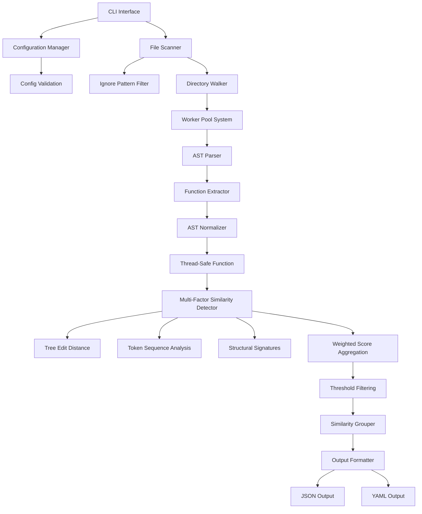

# Go Code Similarity Detection Tool - Architecture Design

## System Overview

**similarity-go** is a high-performance Go code similarity detection CLI tool that uses multi-factor AST analysis to identify duplicate and similar code patterns. The system is designed for scalability, thread safety, and accuracy in detecting code similarities across Go projects.

## Architecture Diagram



## Component Architecture Details

### 1. CLI Interface Layer

**Location**: `cmd/`

```go
// cmd/root.go
type CLIArgs struct {
    threshold   float64
    format      string
    workers     int
    cache       bool
    configFile  string
    output      string
    verbose     bool
    minLines    int
}

// Main CLI command structure
func newRootCommand(args *CLIArgs) *cobra.Command
func runSimilarityCheck(args *CLIArgs, cmd *cobra.Command, targets []string) error
```

**Key Features:**

- Cobra-based CLI with comprehensive flag support
- Configuration file integration
- Input validation and error handling
- Progress reporting and verbose logging

### 2. Configuration Management Layer

**Location**: `internal/config/`

```go
// internal/config/config.go
type Config struct {
    CLI        CLIConfig        `yaml:"cli"`
    Similarity SimilarityConfig `yaml:"similarity"`
    Processing ProcessingConfig `yaml:"processing"`
    Output     OutputConfig     `yaml:"output"`
    Ignore     IgnoreConfig     `yaml:"ignore"`
}

type SimilarityWeights struct {
    TreeEdit           float64 `yaml:"tree_edit"`
    TokenSimilarity    float64 `yaml:"token_similarity"`
    Structural         float64 `yaml:"structural"`
    Signature          float64 `yaml:"signature"`
}
```

**Key Features:**

- YAML-based configuration with validation
- Hierarchical configuration structure
- Default value management with fallbacks
- Runtime configuration validation

### 3. AST Processing Layer

**Location**: `internal/ast/`

```go
// internal/ast/parser.go
type Parser struct {
    fileSet *token.FileSet
}

// internal/ast/function.go
type Function struct {
    Name      string
    File      string
    StartLine int
    EndLine   int
    AST       *ast.FuncDecl
    LineCount int

    // Thread-safe fields with mutex protection
    mu        sync.RWMutex
    hash      string
    signature string
}

// Thread-safe methods with proper locking
func (f *Function) Hash() string
func (f *Function) GetSignature() string
```

**Key Features:**

- Thread-safe function representation with `sync.RWMutex`
- Race condition-free concurrent access
- Efficient AST parsing and function extraction
- Function normalization and structural hashing

### 4. Multi-Factor Similarity Detection Layer

**Location**: `internal/similarity/`

```go
// internal/similarity/detector.go
type Detector struct {
    threshold float64
    config    *config.Config
}

type Match struct {
    Func1 *ast.Function
    Func2 *ast.Function
    Score float64
}

// Multi-factor similarity calculation
func (d *Detector) CalculateSimilarity(f1, f2 *ast.Function) float64 {
    // Combines multiple similarity metrics:
    // - Tree edit distance (30%)
    // - Token sequence similarity (30%)
    // - Structural signatures (25%)
    // - Function signatures (15%)
}
```

**Algorithm Components:**

1. **Tree Edit Distance**: Dynamic programming-based AST structure comparison
2. **Token Sequence Analysis**: Levenshtein distance on normalized token sequences
3. **Structural Signatures**: Function body structure comparison
4. **Signature Matching**: Function signature similarity analysis

**Key Features:**

- Weighted multi-factor scoring system
- Configurable algorithm weights
- Early termination optimizations
- Threshold-based filtering

### 5. Parallel Processing Layer

**Location**: `internal/worker/`

```go
// internal/worker/pool.go
type Pool struct {
    workers     int
    jobs        chan func()
    results     chan interface{}
    wg          sync.WaitGroup
    stopOnce    sync.Once
    stopped     chan struct{}
}

// internal/worker/similarity_worker.go
type SimilarityWorker struct {
    pool      *Pool
    detector  *similarity.Detector
    processor ParallelProcessor
}
```

**Key Features:**

- CPU-efficient worker pools
- Concurrent similarity detection
- Progress callback support
- Graceful shutdown handling

### 6. File System and Scanning Layer

**Location**: `cmd/` (scanning functionality)

```go
// File scanning with intelligent filtering
func scanDirectory(targetPath string, cfg *config.Config) ([]*ast.Function, error)
func parseGoFile(filePath string) ([]*ast.Function, error)
func shouldIgnoreFile(filePath string, patterns []string) bool
```

**Key Features:**

- Recursive directory traversal
- Go file detection and filtering
- Ignore pattern matching (similar to .gitignore)
- Error handling for inaccessible files

## Data Flow Architecture

### 1. Initialization Phase

1. **CLI Argument Parsing**: Command-line arguments and flags processing
2. **Configuration Loading**: YAML configuration file loading with validation
3. **Ignore Pattern Setup**: Pattern matching initialization for file filtering
4. **Worker Pool Creation**: Parallel processing system initialization

### 2. File Discovery Phase

1. **Target Resolution**: Resolve file and directory targets
2. **Directory Traversal**: Recursive scanning with ignore pattern application
3. **Go File Filtering**: Extract `.go` files excluding test files and vendor code
4. **File List Generation**: Create processing queue for AST parsing

### 3. AST Analysis Phase

1. **Parallel Parsing**: Concurrent AST parsing across worker pool
2. **Function Extraction**: Extract function declarations from AST
3. **Structure Normalization**: Normalize AST structures for comparison
4. **Hash Calculation**: Generate structural hashes for functions

### 4. Similarity Detection Phase

1. **Multi-Factor Analysis**: Apply comprehensive similarity algorithm
2. **Threshold Filtering**: Filter results based on similarity thresholds
3. **Group Generation**: Create similarity groups from matched functions
4. **Score Calculation**: Calculate weighted similarity scores

### 5. Output Generation Phase

1. **Result Aggregation**: Collect and organize similarity results
2. **Statistics Generation**: Generate summary statistics
3. **Format Conversion**: Convert to JSON or YAML format
4. **File Output**: Write results to specified output destination

## Algorithm Design Details

### Multi-Factor Similarity Algorithm

The similarity detection uses a weighted combination of four key metrics:

#### 1. AST Tree Edit Distance (Weight: 30%)

```go
func (d *Detector) calculateTreeEditSimilarity(f1, f2 *ast.Function) float64 {
    // Normalized AST tree edit distance calculation
    // Uses dynamic programming for optimal alignment
    distance := d.treeEditDistance(f1.AST, f2.AST)
    maxNodes := float64(max(d.countASTNodes(f1.AST), d.countASTNodes(f2.AST)))
    return 1.0 - (distance / maxNodes)
}
```

#### 2. Token Sequence Analysis (Weight: 30%)

```go
func tokenSequenceSimilarity(f1, f2 *ast.Function) float64 {
    tokens1 := normalizeTokenSequence(f1.AST)
    tokens2 := normalizeTokenSequence(f2.AST)

    // Levenshtein distance on normalized token sequences
    distance := levenshteinDistance(tokens1, tokens2)
    maxLen := float64(max(len(tokens1), len(tokens2)))
    return 1.0 - (distance / maxLen)
}
```

#### 3. Structural Signatures (Weight: 25%)

```go
func (d *Detector) calculateStructuralSimilarity(f1, f2 *ast.Function) float64 {
    sig1 := d.getStructuralSignature(f1.AST)
    sig2 := d.getStructuralSignature(f2.AST)
    return d.compareBodyStructure(sig1, sig2)
}
```

#### 4. Function Signatures (Weight: 15%)

```go
func (d *Detector) calculateSignatureSimilarity(f1, f2 *ast.Function) float64 {
    return d.stringSimilarity(f1.GetSignature(), f2.GetSignature())
}
```

## Performance Optimization Strategies

### 1. Concurrent Processing

- **Worker Pool Architecture**: CPU-efficient parallel processing
- **Thread-Safe Operations**: Race condition-free concurrent access
- **Load Balancing**: Optimal work distribution across CPU cores

### 2. Memory Optimization

- **Efficient AST Representation**: Minimal memory footprint for AST storage
- **Selective Processing**: Process only relevant functions meeting minimum criteria
- **Garbage Collection Optimization**: Minimize allocations in hot paths

### 3. Algorithm Efficiency

- **Early Termination**: Skip comparisons below threshold quickly
- **Structural Pre-filtering**: Use quick heuristics before expensive comparisons
- **Optimized Distance Calculations**: Efficient dynamic programming implementations

### 4. Caching Strategy

- **Result Caching**: Cache similarity calculations for repeated analyses
- **Function Hashing**: Quick identification of identical functions
- **Configuration-Based Caching**: Configurable caching behavior

## Error Handling Architecture

### Error Classification

```go
type ErrorType int
const (
    ParseError ErrorType = iota
    FileSystemError
    ConfigurationError
    ValidationError
    ConcurrencyError
)
```

### Error Handling Strategy

1. **Graceful Degradation**: Continue processing when non-critical errors occur
2. **Comprehensive Logging**: Detailed error reporting with context
3. **User-Friendly Messages**: Clear error messages for end users
4. **Recovery Mechanisms**: Automatic recovery from transient failures

## Testing Architecture

### Test Coverage Strategy

- **Unit Tests**: 78-88% coverage across core packages
- **Integration Tests**: End-to-end workflow validation
- **Race Condition Tests**: Concurrent processing validation
- **Performance Tests**: Scalability and performance benchmarks

### Test Structure

```go
// Example test structure
func TestDetector_CalculateSimilarity(t *testing.T) {
    tests := []struct {
        name     string
        func1    *ast.Function
        func2    *ast.Function
        expected float64
    }{
        // Test cases...
    }
    // Table-driven test implementation
}
```

## Configuration Management

### Configuration File Structure

```yaml
# .similarity-config.yaml
cli:
  default_threshold: 0.8
  default_min_lines: 5
  default_format: "json"
  default_workers: 0  # 0 = use all CPU cores

similarity:
  weights:
    tree_edit: 0.3
    token_similarity: 0.3
    structural: 0.25
    signature: 0.15
  thresholds:
    default_similar_operations: 0.5
  limits:
    max_cache_size: 10000

ignore:
  patterns:
    - "*_test.go"
    - "vendor/"
    - ".git/"
```

## Extensibility Design

### Plugin Architecture Potential

```go
type SimilarityPlugin interface {
    Name() string
    CalculateSimilarity(f1, f2 *ast.Function) float64
    Initialize(config map[string]interface{}) error
}
```

### API Design

```go
// Future API client structure
type Client struct {
    config *config.Config
}

func (c *Client) AnalyzeSimilarity(targets []string) (*SimilarityResult, error)
func (c *Client) CompareFiles(file1, file2 string) (*ComparisonResult, error)
```

## Security Considerations

1. **Input Validation**: Comprehensive validation of all inputs and configurations
2. **Path Traversal Protection**: Safe file path handling and validation
3. **Resource Limits**: Memory and CPU usage bounds to prevent resource exhaustion
4. **Error Information Disclosure**: Careful error message design to avoid information leakage

## Scalability Design

1. **Horizontal Scaling**: Worker pool scaling based on available CPU cores
2. **Memory Efficiency**: Minimal memory footprint for large codebases
3. **Incremental Processing**: Support for processing subsets of large projects
4. **Configurable Limits**: Adjustable limits for various system resources

This architecture provides a solid foundation for reliable, high-performance code similarity detection with excellent maintainability and extensibility characteristics.
