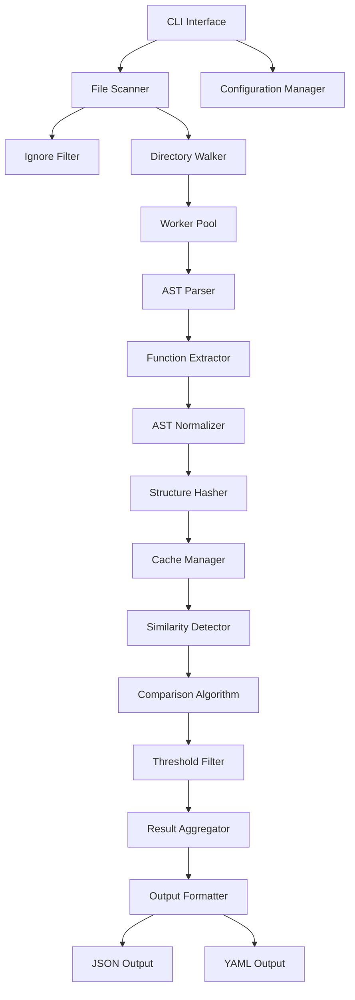

# Go Code Similarity Detection Tool - Architecture Design

## システム概要

Go ASTを利用した高性能なコード類似性検証ツール。重複コードのクローン検出に特化し、AIツールによるリファクタリング支援を目的とする。

## アーキテクチャ図



## コンポーネント詳細設計

### 1. CLI Interface Layer

```go
// cmd/root.go
type Config struct {
    Threshold   float64
    Format      string
    Workers     int
    UseCache    bool
    IgnoreFile  string
    OutputFile  string
    Verbose     bool
    MinLines    int
    Targets     []string
}
```

### 2. File Scanner Layer

```go
// internal/scanner/walker.go
type FileWalker struct {
    ignoreMatcher *IgnoreMatcher
    extensions    []string
}

type ScanResult struct {
    Files []string
    Errors []error
}

func (fw *FileWalker) Walk(targets []string) (*ScanResult, error)
```

### 3. AST Processing Layer

```go
// internal/ast/parser.go
type ASTParser struct {
    fileSet *token.FileSet
}

type ParsedFile struct {
    Path      string
    Functions []*Function
    Hash      string
    Error     error
}

// internal/ast/function.go
type Function struct {
    Name       string
    File       string
    StartLine  int
    EndLine    int
    AST        *ast.FuncDecl
    Normalized *ast.FuncDecl
    Hash       string
    Signature  string
}

// internal/ast/hash.go
type StructureHasher struct {
    ignoreNames bool
    ignoreComments bool
}

func (sh *StructureHasher) HashFunction(fn *ast.FuncDecl) (string, error)
```

### 4. Similarity Detection Layer

```go
// internal/similarity/detector.go
type Detector struct {
    threshold float64
    algorithm ComparisonAlgorithm
}

type SimilarityResult struct {
    Groups []SimilarGroup
    Stats  DetectionStats
}

type SimilarGroup struct {
    ID               string
    SimilarityScore  float64
    Functions        []*Function
    RefactorSuggestion string
}

// internal/similarity/algorithm.go
type ComparisonAlgorithm interface {
    Compare(f1, f2 *Function) (float64, error)
    BatchCompare(functions []*Function) ([]SimilarGroup, error)
}

type StructuralComparison struct {
    weightAST    float64
    weightTokens float64
    weightFlow   float64
}
```

### 5. Cache System

```go
// internal/cache/manager.go
type CacheManager struct {
    storage Storage
    ttl     time.Duration
}

type CacheEntry struct {
    FileHash     string
    Functions    []*Function
    LastModified time.Time
}

type Storage interface {
    Get(key string) (*CacheEntry, error)
    Set(key string, entry *CacheEntry) error
    Delete(key string) error
    Clear() error
}
```

### 6. Worker Pool System

```go
// internal/worker/pool.go
type Pool struct {
    workerCount int
    jobQueue    chan Job
    resultQueue chan Result
    workers     []*Worker
}

type Job struct {
    Type JobType
    Data interface{}
}

type JobType int
const (
    ParseFileJob JobType = iota
    CompareJob
    HashJob
)
```

## データフロー

### 1. 初期化フェーズ

1. CLI引数解析
2. 設定ファイル読み込み
3. Ignore patterns読み込み
4. Worker pool初期化
5. Cache system初期化

### 2. ファイルスキャンフェーズ

1. 対象ディレクトリ/ファイル走査
2. `.go`ファイル抽出
3. Ignore pattern適用
4. ファイルリスト生成

### 3. AST解析フェーズ

1. 並列ファイル解析
2. AST構造抽出
3. 関数レベル分割
4. 構造正規化
5. ハッシュ値計算

### 4. 類似性検出フェーズ

1. キャッシュチェック
2. 関数間類似度計算
3. 閾値フィルタリング
4. 類似グループ生成

### 5. 結果出力フェーズ

1. 結果集約
2. 統計情報生成
3. フォーマット変換
4. ファイル出力

## アルゴリズム設計

### AST構造比較アルゴリズム

#### 1. 構造ハッシュ方式

```go
func (sh *StructureHasher) computeHash(node ast.Node) string {
    var buffer bytes.Buffer
    ast.Inspect(node, func(n ast.Node) bool {
        if n == nil {
            buffer.WriteString("nil")
            return false
        }

        switch typed := n.(type) {
        case *ast.IfStmt:
            buffer.WriteString("if")
        case *ast.ForStmt:
            buffer.WriteString("for")
        case *ast.CallExpr:
            buffer.WriteString("call")
        // 他のノードタイプ...
        }
        return true
    })

    return fmt.Sprintf("%x", sha256.Sum256(buffer.Bytes()))
}
```

#### 2. ツリー編集距離方式

```go
func (sc *StructuralComparison) treeEditDistance(ast1, ast2 ast.Node) float64 {
    // 動的プログラミングによるツリー編集距離計算
    // 挿入、削除、置換のコストを計算
}
```

#### 3. トークンベース比較

```go
func (sc *StructuralComparison) tokenSimilarity(f1, f2 *Function) float64 {
    tokens1 := extractTokens(f1.AST)
    tokens2 := extractTokens(f2.AST)

    // Jaccard係数またはコサイン類似度を計算
    return jaccardSimilarity(tokens1, tokens2)
}
```

## パフォーマンス最適化

### 1. 並列処理戦略

- ファイル解析の並列化
- 関数比較の並列化
- CPU効率的なワーカープール

### 2. メモリ最適化

- AST構造の効率的な表現
- 不要なメタデータの削減
- ガベージコレクション最適化

### 3. キャッシュ戦略

- ファイルハッシュベースキャッシュ
- 関数レベルキャッシュ
- LRU eviction policy

### 4. アルゴリズム最適化

- 早期終了条件
- インデックス構造の活用
- 類似度計算の近似手法

## エラーハンドリング設計

### エラー分類

```go
type ErrorType int
const (
    ParseError ErrorType = iota
    FileSystemError
    CacheError
    ConfigurationError
    ThresholdError
)

type SimilarityError struct {
    Type    ErrorType
    Message string
    File    string
    Line    int
    Cause   error
}
```

### エラー処理方針

1. **非致命的エラー**: ログ出力して処理継続
2. **致命的エラー**: 適切なクリーンアップ後終了
3. **部分的失敗**: 成功した結果のみ出力

## 設定管理

### 設定ファイル例 (.similarity.yaml)

```yaml
threshold: 0.8
format: json
workers: 0  # 0 = auto-detect CPU count
cache:
  enabled: true
  ttl: 24h
  path: .similarity-cache
output:
  file: similarity-report.json
  verbose: false
ignore:
  files:
    - "*.pb.go"
    - "*_test.go"
  directories:
    - vendor/
    - .git/
min_lines: 5
algorithm:
  weights:
    ast: 0.5
    tokens: 0.3
    flow: 0.2
```

## 拡張性設計

### プラグインアーキテクチャ

```go
type Plugin interface {
    Name() string
    Version() string
    Initialize(config map[string]interface{}) error
    Process(input interface{}) (interface{}, error)
}

type ComparisonPlugin interface {
    Plugin
    Compare(f1, f2 *Function) (float64, error)
}
```

### API設計

```go
// pkg/api/client.go
type Client struct {
    config *Config
}

func (c *Client) AnalyzeSimilarity(targets []string) (*SimilarityResult, error)
func (c *Client) CompareFiles(file1, file2 string) (*ComparisonResult, error)
```

## テスト戦略

### 1. 単体テスト

- 各コンポーネントの独立テスト
- モックを使用した依存関係の分離
- カバレッジ目標: 80%以上

### 2. 統合テスト

- エンドツーエンドのワークフローテスト
- 実際のGoプロジェクトを使用したテスト

### 3. パフォーマンステスト

- 大規模プロジェクトでのベンチマーク
- メモリ使用量測定
- 並列処理効率測定

### 4. 回帰テスト

- 既知の類似コードパターンの検証
- アルゴリズム変更時の一貫性確認
